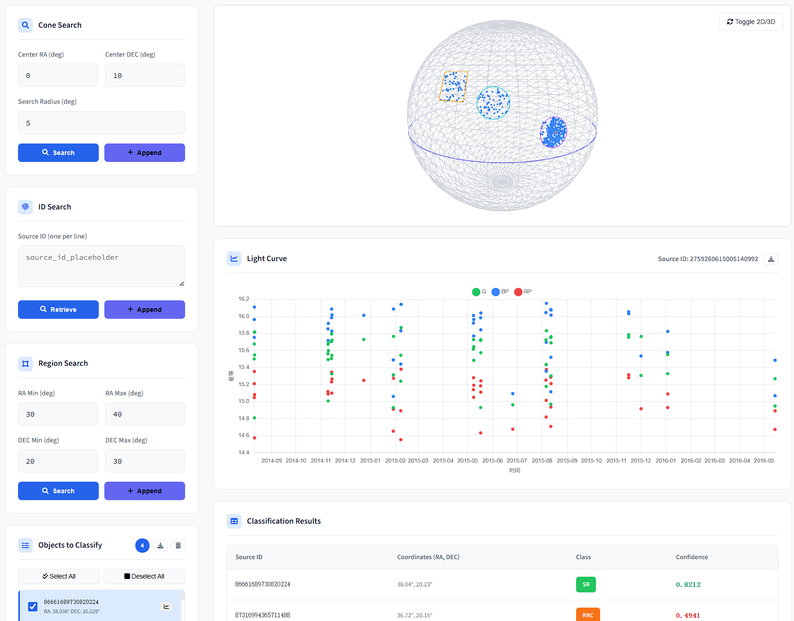
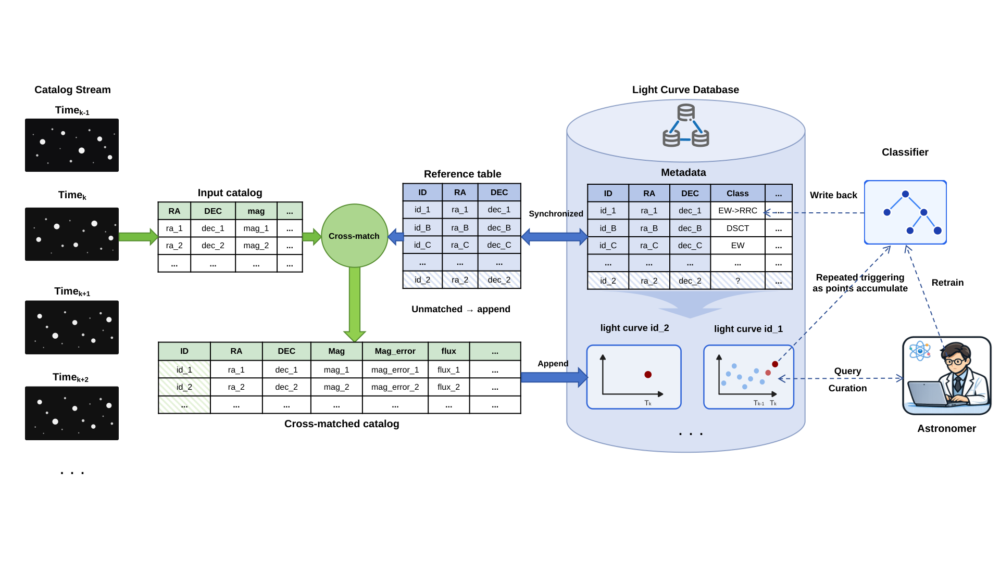

English | [中文](README_CN.md)

# TDlight

> **A light curve management and classification system for time-domain astronomy, powered by TDengine.**
>
> Supports efficient storage, fast retrieval, and intelligent classification of large-scale astronomical time-series data.
>
> **Paper Highlight:** `cross_validate_560_results.csv` in this repository records the **560 high-confidence catalog-disagreement candidates** identified by our classifier for follow-up verification.
>
> **Pre-trained Models:** [HuggingFace — bestdo77/Lightcurve_lgbm_111w_15_model](https://huggingface.co/bestdo77/Lightcurve_lgbm_111w_15_model)

> **Note:** TDlight v2.0.0 adds **incremental training** with auto class detection, **ONNX Runtime** inference (~3.7x faster than sklearn), and a web-based training UI. See [Installation](#installation) and [Incremental Training](#incremental-training) for details.

---

## Quick Start

```bash
git clone https://github.com/bestdo77/TD-light.git
cd TD-light
./install.sh
```

Then open [http://localhost:5001](http://localhost:5001).

For detailed installation options and manual steps, see [INSTALL.md](INSTALL.md).

---

## Table of Contents

- [Web Interface](#web-interface)
- [Tech Stack](#tech-stack)
- [Features](#features)
- [System Architecture](#system-architecture)
- [Installation](#installation)
- [Data Import](#data-import)
- [Search Functions](#search-functions)
- [Classification Functions](#classification-functions)
- [Incremental Training](#incremental-training)
- [API Reference](#api-reference)
- [Troubleshooting](#troubleshooting)

---

## Web Interface



*The TDlight web interface. The left panel provides interactive spatial querying via cone search on a 3D celestial sphere, with search boundaries highlighted. The right panel displays multi-band light curves (G/BP/RP) with classification metadata and statistical properties for the selected source.*

---

## Tech Stack

| Layer | Technology | Description |
|-------|------------|-------------|
| **Database** | TDengine 3.4+ | High-performance time-series database (user-mode, no sudo) |
| **Backend** | C++17 | Raw-socket HTTP server, HEALPix spatial indexing |
| **ML** | Python + LightGBM + ONNX Runtime | `feets` feature extraction + accelerated inference |
| **Training** | Flask (Python) | Incremental model training server with SSE progress |
| **Frontend** | HTML/JS | Three.js 3D celestial sphere, Chart.js interactive plots |

---

## Features

| Feature | Description |
|---------|-------------|
| **Cone Search** | Search objects by celestial coordinates and radius using HEALPix acceleration |
| **Region Search** | Batch query by RA/DEC range |
| **Light Curve Visualization** | Interactive charts for time-series photometry |
| **Intelligent Classification** | Automated variable-star classification using a hierarchical LightGBM predictor |
| **Auto Classification** | Detects new or updated objects automatically and classifies them in batches |
| **Catalog Disagreement Detection** | Identifies 560 high-confidence catalog-disagreement candidates for follow-up verification |
| **Data Import** | One-click CSV import via web UI or high-performance multi-threaded CLI |
| **Incremental Training** | Upload light curves with optional `class` column; auto-detect labels and incrementally train all 7 sub-models |
| **3D Celestial Sphere** | WebGL-rendered interactive sky visualization |

---

## System Architecture



```
┌─────────────────────────────────────────────────────────────────┐
│                        Browser (Frontend)                        │
│   index.html + app.js (Three.js 3D / Chart.js / SSE real-time)  │
└───────────────────────────────┬─────────────────────────────────┘
                                │ HTTP/SSE
                                ▼
┌─────────────────────────────────────────────────────────────────┐
│                      web_api (C++ Backend)                       │
│                      train_server (Flask, :5002)                 │
│                                                                 │
│  ┌─────────────┐  ┌─────────────┐  ┌─────────────────────────┐  │
│  │ Search API  │  │Classify API │  │    Data Import API      │  │
│  │ cone_search │  │  classify   │  │  catalog_importer       │  │
│  │region_search│  │ (calls Py)  │  │  lightcurve_importer    │  │
│  └──────┬──────┘  └──────┬──────┘  └───────────┬─────────────┘  │
│         │                │                     │                │
│         ▼                ▼                     ▼                │
│  ┌─────────────────────────────────────────────────────────────┐│
│  │                    TDengine C Client                         ││
│  │                      (libtaos.so)                            ││
│  └──────────────────────────────┬──────────────────────────────┘│
└─────────────────────────────────┼───────────────────────────────┘
                                  │
                                  ▼
┌─────────────────────────────────────────────────────────────────┐
│              TDengine Time-series Database (User Mode)            │
│                                                                 │
│   Super Table: lightcurves                                      │
│   ├── Tags: healpix_id, source_id, ra, dec, cls                 │
│   └── Columns: ts, band, mag, mag_error, flux, flux_error, jd   │
│                                                                 │
│   VGroups: 128 (supports ~2 complete databases)                 │
└─────────────────────────────────────────────────────────────────┘
```

### Components

1. **Frontend (`index.html` + `app.js`)**
   - REST API via Fetch, real-time progress via Server-Sent Events (SSE)
   - Three.js renders the 3D celestial sphere; Chart.js draws interactive light curves

2. **Backend (`web_api.cpp`)**
   - Pure C++ HTTP server
   - HEALPix sphere pixelization for fast spatial queries
   - Spawns Python classification scripts and C++ importers via subprocesses

3. **Classification (`classify_pipeline.py` / `auto_classify.py`)**
   - Hierarchical LightGBM predictor (4-level tree, 7 sub-models)
   - Feature extraction with `feets`
   - ONNX Runtime by default (~3.7× faster than sklearn); auto-fallback to sklearn if ONNX is unavailable
   - High-confidence results written back to TDengine automatically

4. **Incremental Training (`class/incremental_train.py` + `train_server.py`)**
   - Upload CSV/ZIP light curves via web UI; auto-detect class labels
   - Incrementally train all 7 sub-models with `init_model=old_model`
   - Background ONNX export + model backup/rollback on failure
   - See [Incremental Training](#incremental-training) for full details

5. **Data Importers (`catalog_importer` / `lightcurve_importer`)**
   - Standalone multi-threaded C++ programs
   - Web defaults: 16 threads, 32 VGroups
   - CLI supports custom `--threads` and `--vgroups`

---

## Installation

### One-Command Install (Recommended)

```bash
git clone https://github.com/bestdo77/TD-light.git
cd TD-light
./install.sh
```

The script will:
1. Check dependencies (conda, g++, wget/curl)
2. Download and install TDengine 3.4+ in user mode (`~/taos`)
3. Download pre-trained models from HuggingFace
4. Create the `tdlight` conda environment and install Python dependencies
5. Compile all C++ components (`web_api`, importers, query tools)
6. Configure TDengine and create the default database (`gaiadr2_lc`)
7. Extract test data if available

### Start Services

```bash
# Activate environment
conda activate tdlight
source start_env.sh

# Start TDengine (if not running)
systemctl --user start taosd

# Start services
source start_env.sh        # Starts web_api (5001) + train_server (5002) + TDengine
```

Open [http://localhost:5001](http://localhost:5001).

### Manual Installation

If you prefer to install step-by-step, see [INSTALL.md](INSTALL.md).

---

## Data Import

### Web Interface

Click **Data Import** in the web UI (defaults: 16 threads, 32 VGroups).

### Command Line

```bash
# Catalog import
./insert/catalog_importer \
    --catalogs /path/to/catalogs \
    --coords /path/to/coordinates.csv \
    --db gaiadr2_lc \
    --threads 64 \
    --vgroups 128

# Light curve import
./insert/lightcurve_importer \
    --lightcurves_dir /path/to/lightcurves \
    --coords /path/to/coordinates.csv \
    --db gaiadr2_lc \
    --threads 64 \
    --vgroups 128
```

| Parameter | Default | Description |
|-----------|---------|-------------|
| `--threads` | 16 | Parallel thread count |
| `--vgroups` | 32 | Database VGroups count |
| `--nside` | 64 | HEALPix NSIDE (catalog only) |
| `--drop_db` | - | Drop existing database |

### Required Files

When importing light curves, a **coordinate file** must be provided:

| File | Description |
|------|-------------|
| Light curve directory | One CSV per object (filename contains `source_id`) |
| Coordinate file | Single CSV with `source_id,ra,dec` for all objects |

Coordinates are used to compute HEALPix indices and set table TAGS.

### Data Format

**Light Curve CSV** (one file per object):
```csv
source_id,band,time,mag,mag_error,flux,flux_error,class
12345678,G,2015.5,15.234,0.002,1234.5,2.5,ROT
```

> **Tip:** Add a `class` (or `label` / `type`) column to enable **auto-detect mode** during training upload. Supported values: `Non-var`, `ROT`, `EA`, `EW`, `CEP`, `DSCT`, `RRAB`, `RRC`, `M`, `SR`, `EB`.

**Coordinate File CSV** (one file for all objects):
```csv
source_id,ra,dec
12345678,180.123,-45.678
```

### Database Behavior

| Scenario | Behavior |
|----------|----------|
| Database doesn't exist | Auto-create with 128 VGroups |
| Database exists | Continue using |
| Table exists | Skip creation |
| Insert new data | **Append** to table |
| Timestamp conflict | **Overwrite** old record |

> **VGroups Limit:** `supportVnodes=256` allows ~2 complete databases at once. Delete unnecessary databases before importing to free resources.

---

## Search Functions

### Cone Search

Search by celestial coordinates and radius. Input: RA (°), DEC (°), radius (arcmin). Uses HEALPix index for acceleration.

### Region Search

Batch query by RA/DEC range for bulk retrieval of objects in a region.

---

## Classification Functions

### Inference Acceleration

| Backend | 5,000 samples | Throughput | Note |
|---------|--------------|------------|------|
| sklearn (1 thread) | ~8,300 ms | ~600 samp/s | Baseline |
| sklearn (8 threads) | ~2,000 ms | ~2,500 samp/s | Multi-threaded |
| **ONNX Runtime (8 threads)** | **~400 ms** | **~12,500 samp/s** | **Default, ~3.7× faster** |

Auto-fallback to sklearn if `onnxruntime` is not installed.

### Manual Classification Workflow

1. Select objects in the web UI
2. Click **Start Classification**
3. The system automatically extracts light curves, computes 15 astronomical features with `feets`, runs the hierarchical LightGBM predictor (via ONNX Runtime), and writes high-confidence results back to TDengine

### Automatic Classification

The auto-classifier is fully decoupled from importers:

| Detection Condition | Description |
|---------------------|-------------|
| **First Appearance** | `source_id` not in history file |
| **Data Growth >20%** | Data points increased by >20% compared to history |

**Workflow:**

1. Import data via any importer
2. Click **Query** to run `check_candidates` — compares object counts against `data/lc_counts_<db>.csv` and writes candidates to `data/auto_classify_queue_<db>.csv`
3. Click **Start** to launch `auto_classify.py` — processes in batches (default 5,000), extracts features, runs inference, and writes results

**Features:**
- Interruptible with resume support
- Real-time progress via SSE
- Configurable batch size
- Independent queues and history per database

### Confidence Threshold

Adjustable in **System Settings**:
- Above threshold: automatically written to database
- Below threshold: displayed only

---

## Incremental Training

Upload light curves with optional `class` / `label` / `type` column via the web UI. The system auto-detects labels, extracts 15 `feets` features, and incrementally trains all 7 sub-models using `init_model=old_model`.

**Supported labels:** `Non-var`, `ROT`, `EA`, `EW`, `CEP`, `DSCT`, `RRAB`, `RRC`, `M`, `SR`, `EB`

| Step | Description |
|------|-------------|
| **Upload** | Drag-and-drop CSV or ZIP via the Training tab |
| **Extract** | Auto-extract 15 features per light curve |
| **Train** | Incrementally update relevant sub-models |
| **Export** | Background ONNX export + manual re-export API |
| **Rollback** | Automatic backup restore if training fails |

**API Endpoints:**

| Method | Endpoint | Description |
|--------|----------|-------------|
| POST | `/api/train/upload` | Upload CSV/ZIP |
| POST | `/api/train/start` | Start feature extraction / training |
| GET | `/api/train/stream` | SSE progress stream |
| POST | `/api/train/stop` | Stop training |
| GET | `/api/train/summary` | Training data summary |
| POST | `/api/train/export_onnx` | Manual ONNX export |
| POST | `/api/train/clear` | Clear all training data |

---

## Directory Structure

```
TDlight/
├── config.json              # Main configuration
├── start_env.sh             # Environment activation script
├── install.sh               # One-click installation script
├── INSTALL.md               # Detailed installation guide
├── requirements.txt         # Python dependencies
├── Makefile                 # C++ build (used by install.sh)
│
├── web/                     # Web service
│   ├── web_api.cpp          # C++ HTTP backend
│   ├── build.sh
│   └── static/              # Frontend assets
│
├── class/                   # Classification & training module
│   ├── classify_pipeline.py
│   ├── auto_classify.py
│   ├── hierarchical_predictor.py
│   ├── feature_extractor.py       # feets feature extraction
│   ├── incremental_train.py       # Incremental training pipeline
│   ├── train_server.py            # Flask HTTP server (port 5002)
│   └── training_data_manager.py   # Training data persistence
│
├── insert/                  # Data importers
│   ├── catalog_importer.cpp
│   ├── lightcurve_importer.cpp
│   ├── check_candidates.cpp
│   ├── crossmatch.cpp
│   └── build.sh
│
├── query/                   # Query tools
│   └── optimized_query.cpp
│
├── models/                  # Pre-trained models (auto-downloaded)
│   ├── hierarchical_unlimited/   # 7 sub-models (pkl + onnx)
│   └── lgbm_111w_model.*         # Legacy flat model
│
├── testdata/                # Test data (auto-extracted by install.sh)
├── libs/                    # C++ runtime libraries
├── include/                 # C++ header files
├── config/                  # TDengine client configuration
├── data/                    # Runtime data files (counts, queues)
└── runtime/                 # Runtime logs
```

---

## API Reference

| Endpoint | Method | Description |
|----------|--------|-------------|
| `/api/cone_search` | GET | Cone search |
| `/api/region_search` | GET | Region search |
| `/api/lightcurve/{table}` | GET | Get light curve |
| `/api/classify_objects` | POST | Start classification task |
| `/api/classify_stream` | GET (SSE) | Classification progress |
| `/api/import/start` | POST | Start data import |
| `/api/import/stream` | GET (SSE) | Import progress |
| `/api/import/stop` | POST | Stop import |
| `/api/auto_classify/check` | POST | Trigger candidate detection |
| `/api/auto_classify/candidates` | GET | Count of pending candidates |
| `/api/auto_classify/start` | POST | Start auto-classification |
| `/api/auto_classify/stop` | POST | Stop auto-classification |
| `/api/auto_classify/stream` | GET (SSE) | Auto-classification progress |
| `/api/auto_classify/results` | GET | Auto-classification results |
| `/api/config` | GET/POST | Get / modify configuration |
| `/api/config/reload` | GET | Reload backend configuration |
| `/api/databases` | GET | List databases |
| `/api/database/drop` | POST | Drop a database |
| `/api/train/upload` | POST | Upload training CSV/ZIP |
| `/api/train/start` | POST | Start feature extraction / training |
| `/api/train/stream` | GET (SSE) | Training progress |
| `/api/train/stop` | POST | Stop training |
| `/api/train/summary` | GET | Training data summary |
| `/api/train/export_onnx` | POST | Manual ONNX export |
| `/api/train/clear` | POST | Clear all training data |

---

## Troubleshooting

### Compilation Error: Header Files Not Found

Ensure you compile in the correct directory:
```bash
cd web && ./build.sh
cd ../insert && ./build.sh
```

### Runtime Error: `.so` Files Not Found

```bash
source start_env.sh
# Or manually:
export LD_LIBRARY_PATH=/path/to/TDlight/libs:$LD_LIBRARY_PATH
```

### Cannot Connect to TDengine

1. Confirm `taosd` is running: `systemctl --user status taosd`
2. Check `config.json` database settings
3. Verify port 6030 is accessible

### `feets` Installation Fails (`BadZipFile`)

The `feets` 0.4 package uses an outdated `ez_setup.py` that tries to download an old `setuptools-18.0.1.zip`, which often fails with:
```
zipfile.BadZipFile: File is not a zip file
```

**Solution:** The `install.sh` script handles this automatically. If installing manually:
```bash
pip download feets==0.4 --no-deps -d /tmp/feets_pkg
cd /tmp/feets_pkg && tar -xzf feets-0.4.tar.gz && cd feets-0.4
# Remove broken ez_setup references
sed -i '42,43d' setup.py
sed -i 's/        py_modules=["ez_setup"],//' setup.py
python setup.py install
```

### `taos` Python Connector Not Found

The PyPI package name for the TDengine Python connector is **`taospy`** (imported as `taos`).

If `import taos` fails:
```bash
pip install taospy taos-ws-py
```

### VNodes Exhausted Error

Database VGroups resources exhausted. Solutions:
1. Delete unnecessary databases via the web UI
2. Or increase `supportVnodes` in `config/taos_cfg/taos.cfg`

### No Classification Results

1. Confirm `python` path in `config.json` is correct
2. Confirm the `tdlight` conda environment has all dependencies
3. Check logs in the `class/` directory

### Terminal Crash After `source start_env.sh`

```bash
# Check for incompatible system libraries in libs/
ls libs/ | grep -E "libstdc|libgcc|libgomp"

# If found, remove them (system versions should be used)
rm -f libs/libstdc++.so* libs/libgcc_s.so* libs/libgomp.so*
```

### Port 5001 Already in Use

```bash
lsof -i :5001
# Or change the PORT constant in web/web_api.cpp
```

---

## Large Files

The following files are not included in the repository due to size. They are downloaded automatically by `install.sh`:

| File | Size | How to Obtain |
|------|------|---------------|
| `models/hierarchical_unlimited/*.pkl` | ~350 MB total | Auto-downloaded by `install.sh` |
| `models/hierarchical_unlimited/*.onnx` | ~280 MB total | Auto-downloaded by `install.sh` |
| `data/` | - | User-provided astronomical data |
| TDengine | ~500 MB | Auto-downloaded by `install.sh` |

**Contact:** For pre-trained model or deployment questions, please contact 3023244355@tju.edu.cn.

---

## License

This project is licensed under the **MIT License**. See the [LICENSE](LICENSE) file for details.

---

## Third-Party Libraries

This project includes pre-compiled libraries in `libs/` for convenience:

| Library | License | Source |
|---------|---------|--------|
| CFITSIO | NASA/GSFC (BSD-like) | https://heasarc.gsfc.nasa.gov/fitsio/ |
| HEALPix C++ | GPL v2 | http://healpix.sourceforge.net |
| libsharp | GPL v2 | http://healpix.sourceforge.net |

### HEALPix Citation

If you use this software, please cite HEALPix:

> K.M. Górski, E. Hivon, A.J. Banday, B.D. Wandelt, F.K. Hansen, M. Reinecke, M. Bartelmann (2005),  
> *HEALPix: A Framework for High-Resolution Discretization and Fast Analysis of Data Distributed on the Sphere*,  
> ApJ, 622, p.759-771  
> http://healpix.sourceforge.net

---

## Acknowledgments

- [TDengine](https://www.taosdata.com/) — High-performance time-series database
- [HEALPix](https://healpix.sourceforge.net/) — Hierarchical Equal Area isoLatitude Pixelization
- [feets](https://feets.readthedocs.io/) — Feature Extraction for Time Series
- [LightGBM](https://lightgbm.readthedocs.io/) — Gradient Boosting Framework
- [ONNX Runtime](https://onnxruntime.ai/) — High-Performance Inference Engine
- [Three.js](https://threejs.org/) — WebGL 3D Rendering
- [Chart.js](https://www.chartjs.org/) — Chart Visualization
